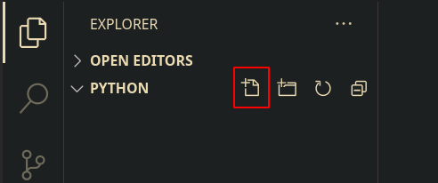
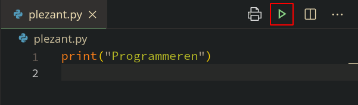

Eerste Programma
================

Voorbereiding
-------------

Je zal al je programma's maken in één folder op je computer.\
Je maakt een folder 'Python' aan in een folder naar jouw keuze (bv. je
Documents-folder).\
Je opent VSCode en kiest linksboven - _File - Open
Folder..._\
Je navigeert naar de folder die je aangemaakt hebt.\
Je kan nu nieuwe bestanden aanmaken in VSCode via de keuze _File - New
File_ of met de knop in de navigatiepaneel.



Je maakt nu een nieuw bestand aan met de naam _plezant.py_
.\
Alle Python bestanden hebben de extensie _.py_ .

**Opgepast:** VSCode zal je waarschuwen dat verschillende bijkomende
extensies nog niet geïnstalleerd zijn. Je accepteert de installatie van
deze extensies. Deze gaan je helpen met het schrijven van je programma
en het opsporen van fouten.

Eerste regel
------------

Je programma zal volgende tekst op het scherm tonen
```
Programmeren
is
plezant 
```
Dit programma zal bestaan uit 3 regels (instructies):

1.  Een regel die de tekst `Programmeren` toont.

2.  Een regel die de tekst `is` toont.

3.  Een regel die de tekst `plezant` toont.

Je tikt nu de eerste regel in je bestand:
```python
print("Programmeren")
```

Bewaren
-------

Je kan je bestand op twee manieren bewaren:

-   Je kiest linksboven _File - Save_

-   Je gebruikt de toetsencombinatie _Ctrl + S_

Je moet altijd je bestand bewaren voor je het uitvoert.

Uitvoeren
---------

Je voert je progamma uit door op de groene driehoek rechtsboven te
klikken.



Je ziet nu de uitvoer van je programma in het Terminal venster
onderaan.\
**Tip:** Als je een programma voortijdig wil stoppen, of je programma
loopt vast, kan je het altijd onderbreken met de toetsencombinatie _Ctrl + C_.

Afwerken
--------

Je breidt het programma uit.\
Je toont ook de tekst 'is'.\
Je tikt volgende regel onderaan je programma:
```python
print("is")
```
Je breidt het programma verder uit.\
Je toont ook de tekst 'plezant'.\
Je voegt volgende regel toe aan je programma:
```python
print("plezant")
```
Je programma ziet er nu zo uit:
```python
print("Programmeren")
print("is")
print("plezant")
```
Je bewaart je programma en voert het uit. Je ziet de uitvoer in je
Terminal scherm:
```
Programmeren
is
plezant
```

Taak
----


[Programmeur](/taken/programmeur.html)

<a class="btn" href="./01_inleiding.html">&#9194; Inleiding</a>
<a class="btn" href="./index.html">&#9195; Index</a>
<a class="btn" href="./03_datatypes.html">Datatypes &#9193;</a>
