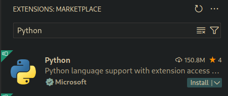

Inleiding
=========

Inleiding
---------

Je leert de basis van programmeren. Een programma is een reeks
instructies die jij schrijft en die de computer uitvoert.

Programmeertalen
----------------

Je schrijft de instructies van een programma in een programmeertaal. Er
bestaan veel programmeertalen.\
De instructies zijn in de meeste programmeertalen Engelse woorden.\
De programmeertaal Python bevat bijvoorbeeld een instructie `print()`.\
Je gebruikt `print()` om iets (bijvoorbeeld een getal) op het scherm te
tonen.\
Je programma bevat instructies die je tikt in een bestand. Zo'n bestand
heet een 'source'.

Python
------

Je gebruikt in deze cursus de programmeertaal Python. Python is een
programmeertaal die ideaal is om te leren programmeren, omdat ze
eenvoudig is.\
Je hebt de Python interpreter nodig om met Python te programmeren.\
De interpreter leest je programma en voert het uit.\
Je kan ook speciale software gebruiken om makkelijker met Python te
programmeren.\
We leren je hoe je de Python interpreter en Visual Studio Code (VSCode)
installeert en hoe je VSCode gebruikt om met Python te programmeren.

De Python interpreter
---------------------

Je downloadt de Python interpreter via de website
`https://www.python.org/`.\
Je downloadt de meest recente versie.\
Je vindt het gedownloade bestand terug in je Downloads folder.\
Je installeert de Python interpreter door op het gedownloade bestand te
dubbelklikken.

Visual Studio Code
------------------

Je downloadt VSCode via de website `https://code.visualstudio.com/`.\
Je vindt het gedownloade bestand terug in je Downloads folder.\
Je installeert VSCode door op het gedownloade bestand te dubbelklikken.

VScode voor Python
------------------

Om met Python te programmeren in VSCode heb je een extensie nodig.\
Een extensie is een uitbreiding van een programma, in dit geval VSCode.\
Open VSCode en klik op de knop 'Extensies' in de linkerbalk.


Er verschijnt een lijst met mogelijke extensies die je in VSCode kan
installeren.\
Je zoekt de extensie 'Python' in het zoekveld.

{width="10cm"}

Je installeert de extensie door op de knop 'Install' te klikken. Je
herstart daarna VSCode.

Eerste Programma
================

Voorbereiding
-------------

Je zal al je programma's maken in één folder op je computer.\
Je maakt een folder 'Python' aan in een folder naar jouw keuze (bv. je
Documents-folder).\
Je opent VSCode en kiest linksboven - [File - Open
Folder...]{.sans-serif}\
Je navigeert naar de folder die je aangemaakt hebt.\
Je kan nu nieuwe bestanden aanmaken in VSCode via de keuze [File - New
File]{.sans-serif} of met de knop in de navigatiepaneel.

{width="10cm"}

Je maakt nu een nieuw bestand aan met de naam [plezant.py]{.sans-serif}
.\
Alle Python bestanden hebben de extensie [.py]{.sans-serif} .

[Opgepast:]{.ul} VSCode zal je waarschuwen dat verschillende bijkomende
extensies nog niet geïnstalleerd zijn. Je accepteert de installatie van
deze extensies. Deze gaan je helpen met het schrijven van je programma
en het opsporen van fouten.

Eerste regel
------------

Je programma zal volgende tekst op het scherm tonen:

        Programmeren
        is
        plezant 

Dit programma zal bestaan uit 3 regels (instructies):

1.  Een regel die de tekst `Programmeren` toont.

2.  Een regel die de tekst `is` toont.

3.  Een regel die de tekst `plezant` toont.

Je tikt nu de eerste regel in je bestand:

    print("Programmeren")

Bewaren
-------

Je kan je bestand op twee manieren bewaren:

-   Je kiest linksboven [File - Save]{.sans-serif}

-   Je gebruikt de toetsencombinatie [Ctrl + S]{.sans-serif}

Je moet altijd je bestand bewaren voor je het uitvoert.

Uitvoeren
---------

Je voert je progamma uit door op de groene driehoek rechtsboven te
klikken.


Je ziet nu de uitvoer van je programma in het Terminal venster
onderaan.\
[Tip:]{.ul} Als je een programma voortijdig wil stoppen, of je programma
loopt vast, kan je het altijd onderbreken met de toetsencombinatie [Crtl
+ C]{.sans-serif}.

Afwerken
--------

Je breidt het programma uit.\
Je toont ook de tekst 'is'.\
Je tikt volgende regel onderaan je programma:

    print("is")

Je breidt het programma verder uit.\
Je toont ook de tekst 'plezant'.\
Je voegt volgende regel toe aan je programma:

    print("plezant")

Je programma ziet er nu zo uit:

    print("Programmeren")
    print("is")
    print("plezant")

Je bewaart je programma en voert het uit. Je ziet de uitvoer in je
Terminal scherm:

        Programmeren
        is
        plezant

Taak
----


Programmeur : zie takenbundel

Datatypes
=========

Je gebruikt in je programma's informatie (data). Voorbeelden van
informatie:

-   De naam van een firma.

-   De prijs van een artikel.

-   Het loon van een bediende.

-   Is iemand gehuwd?

-   Ben je geslaagd voor je rijexamen?

Er bestaan drie basis-datatypes:

De naam van een firma is een tekst. Tekst staat tussen enkele of dubbele
aanhalingstekens (' of \").\
Als een firma 'Frituur Frida heet', schrijf je dat in je programma als
`"Frituur Frida"`.\
Je kan met tekst niet rekenen (optellen, vermenigvuldigen, ...).\
We gebruiken in Python het woord [string]{.sans-serif} voor tekst.

De prijs van een artikel en het loon van een bediende zijn getallen.\
Getallen staan niet tussen aanhalingstekens.\
Als een getal cijfers na de komma bevat, gebruik je een punt als
scheidingsteken.\
Het getal 3,14 staat in je programma dus als `3.14` .\
Je kan met getallen rekenen.\
[Let op:]{.ul} als je een getal tussen aanhalingstekens zet, gaat Python
dit behandelen als tekst.

Een logische waarde is iets dat waar of onwaar is.\
Het feit of iemand gehuwd is, is waar of onwaar.\
Het feit of je geslaagd bent voor je rijexamen, is waar of onwaar.\
In Python spreek je over `True` (waar) of `False` (onwaar).\
In Python schrijf je True en False altijd met een hoofdletter.\
We noemen bij programmeren een logische waarde ook een *boolean* waarde.

 
Datatypes: zie takenbundel.

Getallen
========

Je begint met een eenvoudig programma dat het getal `3.14` toont:

1.  Je creëert in VSCode een nieuw bestand met [File - New
    File]{.sans-serif} of [Ctrl + N]{.sans-serif}. Je noemt dit bestand
    [rekenen.py]{.sans-serif}

2.  Je voegt volgende regel toe:

            print(3.14)

3.  Je bewaart je bestand en voert het uit. Je programma toont `3.14` in
    het terminalvenster onderaan.

Rekenen
-------

Je rekent in veel programma's. Voorbeeld: je maakt een webshop.\
Je moet berekenen hoeveel de klant moet betalen voor de producten in
zijn winkelmandje.\
Je kan in Python (onder andere) deze standaardbewerkingen gebruiken:

1.  optellen

2.  aftrekken

3.  vermenigvuldigen

4.  delen

5.  machtsverheffing

Je breidt je programma uit. Je toont het resultaat van 5 x 3.\
Je voegt daarvoor volgende regel toe aan je programma:

    (*\textcolor{gray}{print(3.14)}*)
    print(5 * 3)

Je programma toont `3.14` en daaronder `15` .

Modulo
------

Python bevat ook een modulobewerking. Je schrijft deze met `%` .\
De modulo is de rest na de gehele deling van twee getallen. Als je 13
deelt door 5 is de rest 3.\
13 gedeeld door 5 is 2,6. Dit is 2 als geheel getal. De rest van de
deling is 3 : 13 - (5 x 2).\
Je voegt volgende regel toe aan je programma:

    ...
    (*\textcolor{gray}{print(5 * \ 3)}*)
    print(13 % 5)

Je programma toont `3` onder de eerste twee uitvoerregels.

 Vermenigvuldigen: zie takenbundel.

Meerdere bewerkingen
====================

Je opent het programma met de naam [rekenen]{.sans-serif} .\
Een berekening bevat soms *meerdere* bewerkingen.\
Voorbeeld: [2 + 3 x 4]{.sans-serif} bevat een + bewerking en een x
bewerking.\
Je programma voert sommige bewerkingen uit *voor* andere bewerkingen.

1.  Eerst machtsverheffingen (`**`).

2.  Daarna modulo bewerkingen (`%`).

3.  Daarna vermenigvuldigen en delen (`*` en `/`).

4.  Tenslotte optellen en aftrekken (`+` en `-`).

In het voorbeeld [2 + 3 x 4]{.sans-serif} voert je programma dus eerst
[3 x 4]{.sans-serif} uit.\
Daarna telt je programma 2 op bij 12 (de uitkomst van [3 x
4]{.sans-serif}).\
Het eindresultaat bij de berekening is dus 14.\
Je wil soms *zelf* bepalen dat een bewerking *voor* een andere bewerking
wordt uitgevoerd.\
Voorbeeld: je wil bij [2 + 3 x 4]{.sans-serif} eerst de + uitvoeren,
daarna de x.\
Je drukt dit in wiskunde uit met ronde haakjes: [(2 + 3) x
4]{.sans-serif}.\
Bewerkingen tussen ronde haakjes worden eerst uitgevoerd.\
Het resultaat is 20: eerst [2 + 3]{.sans-serif}, daarna dit resultaat
[(5) x 4]{.sans-serif}.\
Je drukt dit in Python op dezelfde manier uit.\
Je voegt volgende regels toe aan je programma:

    ...
    (*\textcolor{gray}{print(13 \% \ 5)}*)
    print(2 + 3 * 4)
    print((2 + 3) * 4)

Je bewaart en voert het programma uit. In je uitvoer zie je onderaan de
getallen 14 en 20.\
 Percentage: zie takenbundel.

Variabelen
==========

Een variabele is een plaats in het interne geheugen van je computer
(RAM). Je bewaart gegevens in een variabele: een string, een getal of
een logische waarde.\
Voorbeeld: je maakt een variabele. Je bewaart er je voornaam in. Je kan
verder in je programma de informatie uit de variabele lezen, en er iets
mee doen: op het scherm tonen, of gebruiken in een berekening ...\
Je maakt zoveel variabelen als je denkt nodig te hebben. Je geeft elke
variabele een unieke naam. Je onderscheidt zo de variabelen van elkaar.\
Jij kiest zelf de naam voor elke variabele. De naam mag in de meeste
programmeertalen geen spaties bevatten en niet met een cijfer beginnen.
Je kiest een naam die duidelijk aangeeft waarvoor je de variabele
gebruikt.\
Dit maakt je programma leesbaar en makkelijker te begrijpen.

-   Je maakt een variabele `aantalKinderen`.\
    Je bewaart in deze variabele hoeveel kinderen je hebt.

-   Je maakt nog een variabele met de naam `zakgeld`.\
    Je bewaart in deze variabele hoeveel zakgeld elk kind krijgt.

Moderne programmeurs gebruiken een afspraak voor de schrijfwijze van
variabelen. Deze afspraak heet camelcase. Je tikt daarbij de naam van
een variabele in kleine letters.\
Als de naam bestaat uit meerdere woorden, begin je elk nieuw woord met
een hoofdletter. Je gebruikt geen spaties.\
Voorbeelden: `aantalKinderen`, `grootsteWedde`,
`kortingVoorGroteGezinnen`.

Voorbeeld
---------

Je maakt een voorbeeld:

-   Je maakt een variabele met de naam `voornaam`. De inhoud is de
    string `Mia`.

-   Je maakt een variabele met de naam `aantalKinderen`. De inhoud is
    het getal `3`.

-   Je maakt een variabele met de naam `gehuwd`. De inhoud is de waarde
    `True`.

-   Je toont daarna de inhoud van de variabelen.

Je maakt het programma.

1.  Je maakt een nieuw bestaand aan met de naam
    [persoon.py]{.sans-serif}.

2.  Je maakt een variabele aan met de naam `voornaam` en de waarde
    `"Mia"`. Je schrijft dit op volgende manier in Python.

                voornaam = "Mia"

3.  Je maakt een variabele aan met de naam `aantalKinderen` en de waarde
    `3`.

4.  Je maakt een variabele aan met de naam `gehuwd` en de waarde `True`.

            (*\textcolor{gray}{voornaam = "Mia"}*)
            aantalKinderen = 3
            gehuwd = True

5.  Je toont nu de waarde van de variabele `voornaam` in het
    uitvoerscherm.

            ...
            (*\textcolor{gray}{gehuwd = True}*)
            print(voornaam)

6.  Je toont ook de waarden van de variabelen `aantalKinderen` en
    `gehuwd`.

            ...
            (*\textcolor{gray}{print(voornaam)}*)
            print(aantalKinderen)
            print(gehuwd)

7.  Je bewaart en voert uit.

Je ziet volgende uitvoer in het terminalvenster:

        Mia
        3
        true

 Film: zie takenbundel.

Wijzigen
--------

Je kan de waarde van een variabele wijzigen (\"variabel\"). Je kan in de
loop van je programma een andere waarde in je variabele plaatsen.\
Voorbeeld: Mia krijgt nog een kind: het aantal kinderen wijzigt van 3
naar 4.\
Je opent het programma [persoon.py]{.sans-serif}. Je voegt onderaan
volgende regel toe:

    ...
    (*\textcolor{gray}{print(gehuwd)}*)
    aantalKinderen = 4
    print(aantalKinderen)

Je bewaart en voert uit. Je ziet volgende uitvoer in het
terminalvenster:

        Mia
        3
        True
        4

Gebruik in een berekening
-------------------------

Je kan de inhoud van een variabele gebruiken in een berekening.\
Voorbeeld: Mia krijgt €120 kindergeld per kind. Je berekent het totale
kindergeld als volgt: lees de inhoud van de variabele `aantalKinderen`
(4) en vermenigvuldig dit met 120.\
Je kan het resultaat van de berekening:

-   rechtstreeks tonen op het scherm

-   of bewaren in een nieuwe variabele, bijvoorbeeld `totaalKindergeld`.

Je kiest hier voor het rechtstreeks tonen. Voeg volgende regel toe aan
je programma:

    ...
    (*\textcolor{gray}{print(aantalKinderen)}*)
    print(aantalKinderen * 120)

Je bewaart en voert uit. Je ziet nu volgende uitvoer onderaan in het
terminalvenster:

        480

 Lotto: zie takenbundel.

Opvragen
========

Je opent het bestand [persoon.py]{.sans-serif}. Het programma is niet
flexibel:

-   De voornaam Mia staat in je programma. Als Piet het programma
    gebruikt en wil dat Mia wordt vervangen door zijn naam, moet hij het
    programma wijzigen. Dit is niet de bedoeling: de gebruiker van je
    programma moet niet kunnen programmeren.

-   Het aantal kinderen staat in je programma. Als Piet het programma
    gebruikt en dat aantal wil vervangen door zijn eigen aantal
    kinderen, moet hij het programma wijzigen.

Om het programma flexibel te maken

-   tik je de voornaam niet in je programma terwijl *jij* het programma
    maakt,

-   maar laat je de *gebruiker* zijn voornaam intikken tijdens de
    uitvoering van het programma. Je onthoudt de getikte tekst in de
    variabele `voornaam`.

Je doet dit als voorbeeld met de voornaam:

1.  je vervangt de regel `voornaam = "Mia"` door volgende regel:

            voornaam = input()
            (*\textcolor{gray}{aantalKinderen = 3}*)
            ...

    De instructie `input()` laat je toe informatie te tikken in het
    terminalscherm. Python bewaart de invoer daarna in de variabele
    `voornaam`.

2.  Wanneer de gebruiker de tekst intikt kan je hem uitleggen wat hij
    moet tikken. Deze uitleg zet je tussen de haakjes van `input()`. Je
    past de regel aan:

            voornaam = input("Wat is je voornaam? ")
            (*\textcolor{gray}{aantalKinderen = 3}*)
            ...

Je bewaart en voert uit. De gebruiker kan nu zijn voornaam intikken. Als
hij de voornaam [Piet]{.sans-serif} intikt, zie je dat de variabele
`voornaam` de tekst [Piet]{.sans-serif} bevat:

        Piet
        3
        True
        4
        480

Je vraagt ook het aantal kinderen aan de gebruiker.\
[Opgepast!]{.ul} Het type van de functie `input()` is **altijd** een
string.\
Als je met je invoer wil rekenen, moet je de invoer omzetten naar een
getal.\
Je kan hiervoor de functie `int()` gebruiken voor gehele getallen, en
`float()` voor reële getallen.\
Je probeert dit hier al uit, ook al gaan we met de invoer niet rekenen.

1.  Je vervangt de regel `aantalKinderen = 3` door volgende regel:

            ...
            (*\textcolor{gray}{voornaam = input("Wat is je voornaam?")}*)
            aantalKinderen = int(input("Hoeveel kinderen heb je?"))
            ...

2.  Je verwijdert de regel `aantalKinderen = 4`.

Je bewaart en voert uit.

 Rechthoek: zie takenbundel.\
 Cirkel: zie takenbundel.

Een getalvariabele veranderen
=============================

Je moet regelmatig een variabele die een getal bevat, met een waarde
verhogen of verlagen.\
Voorbeeld: Je hebt drie kinderen. Je onthoudt dit in een variabele
`aantalKinderen`.\
Als nog een tweeling geboren wordt, verhoog je de variabele met twee.\
Je creëert een nieuw bestand [tweeling.py]{.sans-serif}. Je voert
volgende regels in:

    aantalKinderen = 3
    aantalKinderen = aantalKinderen + 2
    print(aantalKinderen)

Je bewaart en voert uit. Je krijgt volgende uitvoer te zien:

        5

Je kan de waarde van een berekening met een variabele, weer in dezelfde
variabele stoppen.\
Er bestaat ook een kortere schrijfwijze.\
Je vervangt de regel `aantalKinderen = aantalKinderen + 2` door volgende
regel:

    (*\textcolor{gray}{aantalKinderen = 3}*)
    aantalKinderen += 2
    (*\textcolor{gray}{print(aantalKinderen)}*)

Je bewaart en voert uit. Je krijgt dezelfde uitvoer te zien.\
Je kan deze schrijfwijze ook toepassen op delen (`/=`), vermenigvuldigen
(`*=`), en aftrekken (`-=`).

 Ticket: zie takenbundel.

Concateneren
============

Je gebruikt tot nu toe `print()` om iets op het scherm te tonen.\
`print()` toont zijn informatie op het scherm en zorgt ervoor dat de
volgende informatie op een nieuwe regel getoond wordt.\
Je wil soms informatie *naast elkaar* tonen.\
Je gebruikt dan het [+]{.sans-serif}-teken binnen de haakjes van de
`print()` om verschillende stukken informatie naast elkaar te tonen.\
Dit noemt men **concateneren**.

Concateneren van strings
------------------------

Je maakt een nieuw bestand [concateneren.py]{.sans-serif}. Je voert
volgende regels in:

    print("Een.")
    print("Twee." + "Drie." + "Vier")
    print("Vijf.")    

Je bewaart en voert uit. Je krijgt volgende uitvoer te zien:

        Een.
        Twee.Drie.Vier.
        Vijf.

[Let op]{.ul}: Als je spaties wil weergeven, ga je deze zelf in je
strings moeten toevoegen.

Concateneren van andere types
-----------------------------

Je voegt een nieuwe regel toe:

    ...
    (*\textcolor{gray}{print("Vijf.")}*)
    print("Zes." + 7 + "Acht.")

Je bewaart en voert uit.\
Je krijgt nu een foutmelding te zien:\
`TypeError: can only concatenate str (not "int") to str`.\
Python kan geen getallen (of logische waarden) concateneren met
strings.\
Je lost dit op door het getal om te zetten naar een string. Dit doe je
met de functie `str()`.\
Je verandert de laatste regel van je programma:

    ...
    (*\textcolor{gray}{print("Vijf.")}*)
    print("Zes." + str(7) + "Acht.")

Je bewaart en voert uit. Je krijgt volgende uitvoer te zien:

        Een.
        Twee.Drie.Vier.
        Vijf.
        Zes.7Acht.

Om de uitvoer leesbaarder te maken, voegen we in de laatste regel
spaties toe aan het einde van `"Zes."` en aan het begin van `"Acht."`:

    ...
    (*\textcolor{gray}{print("Vijf.")}*)
    print("Zes. " + str(7) + " Acht.")

Je bewaart en voert uit. Je krijgt volgende uitvoer te zien:

        Een.
        Twee.Drie.Vier.
        Vijf.
        Zes. 7 Acht.

Een alternatief voor print()
----------------------------

Je kan binnen de instructie `print()` ook een komma gebruiken om
verschillende elementen na elkaar op het scherm te tonen.\
Je hoeft dan getallen en booleans niet om te zetten naar string. Je
hoeft dan ook geen extra spaties te zetten tussen de verschillende
elementen.\
[Let op:]{.ul} dit werkt enkel binnen de instructie `print()`!\
Je verandert de laatste regel van je programma:

        ...
        (*\textcolor{gray}{print("Vijf.")}*)
        print("Zes.", 7, "Acht.")

Je bewaart en voert uit. Je krijgt dezelfde uitvoer te zien.

 Vierkant: zie takenbundel.

Vergelijken
===========

Je moet in veel programma's waarden vergelijken. Bijvoorbeeld: je
programmeert een spelletje.\
Je vergelijkt dan de score van de speler met de hoogste score van de
vorige spelers.\
Als de score van de speler *groter* is dan de hoogste score
(vergelijking), wijzig je de hoogste score naar de score van die
speler.\
Je leert hier hoe je eenvoudige vergelijkingen doet in je programma.

Getallen
--------

Je maakt een getal dat controleert of 5 groter is dan 3.

1.  Je maakt een nieuw bestand [vergelijken.py]{.sans-serif}.

2.  Je voegt volgende regel toe:

        print(5 > 3)

    Je kan op verschillende manieren vergelijken:

    -   `==` : Zijn twee getallen gelijk?

    -   `!=` : Zijn ze verschillend?

    -   `<` : Is het eerste *kleiner dan* het tweede?

    -   `<=` : Is het eerste *kleiner of gelijk aan* het tweede?

    -   `>` : Is het eerste *groter dan* het tweede?

    -   `>=` : Is het eerste *groter of gelijk aan* het tweede?

Let op de dubbele `==`. Je gebruikt de enkele `=` in Python om een
waarde te geven aan een variabele.\
Je gebruikt de dubbele `==` om twee waarden te vergelijken.\
Je bewaart en voert uit. Je krijgt volgende uitvoer te zien:

        True

Dit betekent: het is waar (True) dat 5 groter is dan 3. Je kan ook
variabelen vergelijken.\
Voorbeeld: Je vraagt je eigen lengte. Je vraagt de lengte van je
buurman. Je vergelijkt beide lengtes.\
Vervang de regel in je programma door volgende regels:

    mijnLengte = float(input("Wat is jouw lengte?"))
    lengteBuurman = float(input("Wat is de lengte van je buurman?"))
    print(mijnLengte > lengteBuurman)

Je bewaart en voert uit.\
[Let op:]{.ul} Als je de instructie `float()` niet gebruikt, gaat Python
de getallen alfabetisch vergelijken: 11 is dan bijvoorbeeld kleiner dan
2, omdat 1 voor 2 komt.

Strings
-------

Je kan ook strings vergelijken.\
Een string is 'groter' dan een tweede string als de string alfabetisch
*na* de tweede string komt.\
De string [Benny]{.sans-serif} is bijvoorbeeld 'groter' dan de string
[Agnetha]{.sans-serif}.\
Een string is 'kleiner' dan een tweede string als de string alfabetisch
*voor* de tweede string komt.\
De string [appel]{.sans-serif} is bijvoorbeeld 'kleiner' dan de string
[peer]{.sans-serif}.\
Je voegt volgende regel toe aan je programma:

    ...
    (*\textcolor{gray}{print(mijnLengte > lengteBuurman)}*)
    print("limonade" < "bier")

Je bewaart en voert uit. De tweede uitvoer is `False`.\
Het is onwaar (False) dat de string [limonade]{.sans-serif} alfabetisch
voor de string [bier]{.sans-serif} komt.

 Vergelijken: zie takenbundel.

If
==

Je doet in het dagelijks leven bepaalde handelingen enkel als aan een
voorwaarde voldaan is.\
Voorbeeld: je doet niet altijd een dikke jas aan. Je doet enkel een
dikke jas aan als het koud is.\
Je kan in je programma bepaalde blokken ook enkel uitvoeren als aan een
voorwaarde voldaan is.

Voorbeeld
---------

Voorbeeld: De gebruiker tikt een temperatuur.\
Je onthoudt dit getal in de variabele `temperatuur`.\
Enkel als de temperatuur kleiner is of gelijk aan 0 toon je de tekst
[Het vriest.]{.sans-serif} en de tekst [Je doet beter een dikke jas
aan.]{.sans-serif}\
Je merkt in de zin een vergelijking: temperatuur kleiner is of gelijk
aan 0.\
Anders uitgedrukt: `temperatuur <= 0` (zie vorig hoofdstuk).

1.  Je maakt een nieuw bestand [weer.py]{.sans-serif} .

2.  Je voegt volgende regels toe:

    ```python
    temperatuur = float(input("Temperatuur: "))
    if temperatuur <= 0:
        print("Het vriest.")
        print("Je doet beter een dikke jas aan.")
    ```

Je bewaart en voert het programma enkele keren uit. Enkel als je een
temperatuur lager of gelijk aan 0 tikt, toont het programma je de
volgende uitvoer:

        Het vriest.
        Je doet beter een dikke jas aan.

Je ziet dat de regels onder `if (temperatuur <= 0):` meer naar rechts
staan.\
Deze regels worden alleen uitgevoerd als de voorwaarde van de `if` waar
is.\
Dit principe noem je *indenteren*. Python gebruikt indenteren om
verschillende onderdelen van je programma te onderscheiden.\
VSCode zet deze regels meestal automatisch naar rechts.\
Om daarna terug naar het normale programmaverloop te gaan, moeten de
volgende regels weer naar links staan.\
Dit moet je zelf doen. Je kan dit doen met de toets
[Backspace]{.sans-serif} of de toetsencombinatie [Shift +
Tab]{.sans-serif}.\
Je voegt volgende regel toe aan het programma:

        ...
        (*\textcolor{gray}{print("Je doet beter een dikke jas aan"))}*)
    print("Einde van het programma.")

Je zorgt dat deze regel helemaal links staat. Je bewaart en voert uit.
Je ziet dat de laatste regel altijd getoond wordt, ook als de
temperatuur lager is dan 0.

 Volwassen: zie takenbundel.\
 Limonades: : zie takenbundel.

Else
====

Je opent het bestand [weer.py]{.sans-serif}. Je wil ook iets uitvoeren
als de voorwaarde bij `if` *niet waar* is.\
Voorbeeld: je toont de tekst `Een lichte jas volstaat.` enkel als de
temperatuur *niet* kleiner of gelijk is aan 0.\
Je voegt daartoe een else onderdeel toe aan de if:

    ...
        (*\textcolor{gray}{print("Je doet beter een dikke jas aan"))}*)
    else:
        print("Een lichte jas volstaat.")
    (*\textcolor{gray}{print("Einde van het programma.")}*)

Let goed op de indentering. `else` staat weer naar links, en je `print`
weer naar rechts.\
Je bewaart en voert uit. Enkel als je een temperatuur tikt groter dan 0
zie je de tekst `Een lichte jas volstaat.`

 Kind : zie takenbundel.\
 Kelvin: zie takenbundel.\
 Even: zie takenbundel.

Meerdere If Blokken
===================

Je opent het bestand [weer.py]{.sans-serif}. Je programma bevat zoveel
`if` instructies als je nodig hebt.\
Je breidt je programma uit: je vraagt aan de gebruiker of het zal
regenen.\
Enkel als hij `ja` antwoordt, toon je de tekst `Neem een paraplu mee.`\
Je voegt volgende regels toe:

    ...
        (*\textcolor{gray}{print("Je doet beter een dikke jas aan"))}*)
    (*\textcolor{gray}{else:}*)
        (*\textcolor{gray}{print("Een lichte jas volstaat.")}*)
    regen = input("Zal het regenen? (tik ja of nee):")
    if regen == "ja":
        print("Neem een paraplu mee.")
    (*\textcolor{gray}{print("Einde van het programma.")}*)

Let op de dubbele `==`.\
Je bewaart en voert uit.

 Delen: zie takenbundel.

OR en AND
=========

Je leert voorwaarden combineren met [Or]{.sans-serif} en met
[And.]{.sans-serif}

Or
--

De toegangsprijs in een pretpark is €5 als je leeftijd lager is dan 7
**of** hoger is dan 80. Anders is de toegangsprijs €10.\
De eerste zin bevat *twee* voorwaarden:

-   leeftijd lager dan 7

-   leeftijd hoger dan 80

De voorwaarden worden gecombineerd met `or` (of).\
Bij [or]{.sans-serif} is de combinatie waar (True) als één van de twee
voorwaarden waar (True) is.\
[Voorbeeld 1]{.ul}: een bezoeker met een leeftijd van 4 jaar.

-   De eerste voorwaarde (leeftijd \< 7) is waar.

-   De tweede voorwaarde (leeftijd \> 80) is onwaar.

-   Omdat de eerste voorwaarde waar is, is de combinatie ook waar. De
    bezoeker betaalt €5.

[Voorbeeld 2]{.ul}: een bezoeker met een leeftijd van 90 jaar.

-   De eerste voorwaarde (leeftijd \< 7) is onwaar.

-   De tweede voorwaarde (leeftijd \> 80) is waar.

-   Omdat de tweede voorwaarde waar is, is de combinatie ook waar. De
    bezoeker betaalt €5.

[Voorbeeld 3]{.ul}: een bezoeker met een leeftijd van 45 jaar.

-   De eerste voorwaarde (leeftijd \< 7) is onwaar.

-   De tweede voorwaarde (leeftijd \> 80) is onwaar.

-   Omdat geen enkele voorwaarde waar is, is de combinatie onwaar. De
    bezoeker betaalt €10.

Je maakt dit programma. Je maakt een nieuw bestand
[prijs.py]{.sans-serif}. Je schrijft volgende regels:

```python
leeftijd = int(input("Leeftijd: "))
if leeftijd < 7 or leeftijd > 80:
    print("Prijs: €5")
else:
    print("Prijs: €10")
```

Je bewaart en test je programma met verschillende leeftijden.

And
---

Je maakt een programma dat je BMI (Body Mass Index) berekent.\
Het BMI bereken je als volgt: gewicht gedeeld door het kwadraat van de
lengte.\
Als je BMI ligt tussen 18.5 **en** 25 heb je een normaal gewicht.\
Deze zin bevat twee voorwaarden:

-   BMI groter of gelijk aan 18.5

-   BMI kleiner of gelijk aan 25

De voorwaarden worden gecombineerd met **en** (`and`). Bij `and` is de
combinatie enkel waar als *alle* voorwaarden waar zijn.\
underlineVoorbeeld 1: een BMI van 15.

-   De eerste voorwaarde (bmi \>= 18.5) is onwaar.

-   De tweede voorwaarde (bmi \<= 25) is waar.

-   Omdat de eerste voorwaarde onwaar is, is de combinatie onwaar. Het
    gewicht is niet ok.

[Voorbeeld 2:]{.ul} een BMI van 30.

-   De eerste voorwaarde (bmi \>= 18.5) is waar.

-   De tweede voorwaarde (bmi \<= 25) is onwaar.

-   Omdat de tweede voorwaarde onwaar is, is de combinatie onwaar. Het
    gewicht is niet ok.

[Voorbeeld 3:]{.ul} een BMI van 23.

-   De eerste voorwaarde (bmi \>= 18.5) is waar.

-   De tweede voorwaarde (bmi \<= 25) is waar.

-   Omdat *alle* voorwaarden waar zijn, is de combinatie waar. Het
    gewicht is ok.

Je maakt een nieuw bestand aan met de naam [bmi.py]{.sans-serif} . Je
schrijft volgende regels:

```python
gewicht = float(input("Gewicht in kilogram: "))
lengte = float(input("Lengte in meter: "))
bmi = gewicht / lengte ** 2
if (bmi >= 18.5 and bmi <= 25):
    print("OK")
```

 Café: zie takenbundel\
 Leeftijd: zie takenbundel

Nesten
======

Je kan binnen `if`-blokken opnieuw een `if` plaatsen. Men spreekt dan
over 'nesten'.\
Het is aan jou om na te denken over hoe je dit nesten gebruikt naarmate
je grotere programma's maakt.\
Voorbeeld: Je laat de gebruiker een temperatuur intikken. Als de
temperatuur kleiner of gelijk is aan 0 (controle met een `if`) zijn er
nog twee mogelijkheden:

-   Als de temperatuur lager is dan -40, toon je de tekst `Blijf thuis`.

-   Anders toon je de tekst `Doe een dikke jas aan`.

Je nest een `if-else` *binnen* de eerste `if` om de ene of de andere
tekst te tonen.\
Je maakt een nieuw bestand [thuis.py]{.sans-serif}. Je schrijft volgende
regels:

```python
temperatuur = float(input("Temperatuur: "))
if temperatuur <= 0:
    if temperatuur < -40:
        print("Blijf thuis.")
    else:
        print("Doe een dikke jas aan.")
```

Je bewaart en voert uit.

-   Als je een positieve temperatuur intikt toont je programma niets.

-   Als je een temperatuur intikt lager dan -40 zie je `Blijf thuis`.

-   Als je een temperatuur intikt tussen 0 en -40 zie je
    `Doe een dikke jas aan`.

 VDAB: zie takenbundel\
 Grootste: zie takenbundel\
 Examens: zie takenbundel\
 Schrikkeljaar: zie takenbundel\
 Kindergeld: zie takenbundel

While
=====

De programma's die je tot nu toe gemaakt hebt, voeren opdrachten één
keer uit.\
Je moet soms bepaalde opdrachten *meerdere* keren uitvoeren zolang aan
een *voorwaarde* voldaan is.

Voorbeeld
---------

Je houdt bij hoeveel geld de mensen storten voor een goed doel.\
Telkens iemand een bedrag stort, tikt de gebruiker dit bedrag en toon je
de opbrengst. Als de actie voorbij is stopt het programma.\
We spreken af dat de gebruiker dan `0` tikt, waar hij normaal een bedrag
tikt.\
Je ziet volgend herhalend patroon: *zolang* (`while`) de gebruiker niet
`0` tikt:

1.  tel je het getikte bedrag bij de totale opbrengst

2.  en toon je de opbrengst.

Je programma *herhaalt* deze stappen zoveel keer als er mensen een
bedrag storten. Je programmeert zo'n herhaling met een nieuwe
instructie: `while`. Je maakt een nieuw bestand
[goededoel.py]{.sans-serif}.

1.  Je maakt een variabele met de naam `opbrengst`. Je initialiseert de
    variabele op 0. Je vraagt daarna aan de gebruiker een eerste
    gestorte bedrag:

            opbrengst = 0
            gestort = float(input("Gestort bedrag (0 om te stoppen): "))

2.  *Zolang* de variabele `gestort` verschilt van 0, moet je programma
    enkele instructies uitvoeren. Je voegt daarvoor een `while`
    instructie toe. Je geeft de *voorwaarde* aan. *Zolang* deze waar
    (`True`) is, herhaalt je programma enkele instructies:

    -   een instructie die het gestorte bedrag optelt bij de opbrengst.

    -   een instructie die de opbrengst toont.

    -   een instructie waarmee de gebruiker het volgende bedrag kan
        intikken.

    ```{=html}
    <!-- -->
    ```
            ...
            (*\textcolor{gray}{gestort = float(input("Gestort bedrag (0 om te stoppen): "))}*)
            while gestort != 0:
                opbrengst += gestort
                print(opbrengst)
                gestort = float(input("Gestort bedrag (0 om te stoppen): "))

Je bewaart en voert uit.\
Opmerking: je programma kan *meerdere* `while` en/of `if` isntructies
bevatten.\
Opmerking: een synoniem voor herhalen is *itereren*. Een synoniem voor
herhaling is *iteratie*.

 Gemiddelde: zie takenbundel.

Nog nesten
==========

Je leerde dat je in een `if` nog een `if` kan nesten. De mogelijkheden
van nesten zijn eindeloos:

-   een `if` in een `while`

-   een `while` in een `if`

-   een `while` in een `while`

-   een `while` in een `if` in een `while`

-   ...

Voorbeeld: Een pretpark wil op het einde van de dag weten hoeveel
volwassenen het park bezochten en hoeveel kinderen het park bezochten.\
De gebruiker tikt de leeftijd van elke bezoeker.\
Als de leeftijd hoger of gelijk is aan 18, verhoog je de variabele voor
het aantal volwassenen met 1.\
Anders vehoog je de variabele voor het aantal kinderen met 1.\
Op het einde van de dag tikt de gebruiker `0` als leeftijd om het
invoeren te stoppen.\
Je toont dan het aantal volwassenen en het aantal kinderen.\
Je maakt een nieuw bestand [pretpark.py]{.sans-serif}. Je schrijft
volgende regels:

```python
aantalVolwassenen = 0
aantalKinderen = 0
leeftijd = int(input("Leeftijd (0 om te stoppen): "))
while leeftijd != 0:
    if leeftijd >= 18:
        aantalVolwassenen += 1
    else:
        aantalKinderen += 1
    leeftijd = int(input("Leeftijd (0 om te stoppen): "))
print("Aantal volwassenen: " + str(aantalVolwassenen))
print("Aantal kinderen: " + str(aantalKinderen))
```

Je ziet in het programma een `while` instructie met een geneste `if`
instructie.\
Je bewaart en test het programma.

 Korting: zie takenbundel.\
 Temperaturen: zie takenbundel.\
 Hoger Lager: zie takenbundel.\
 Priemgetal: zie takenbundel.\
 KMI: zie takenbundel.

For
===

Je moet in veel programma's een variabele bij elke iteratie met een
waarde verhogen.\
Voorbeeld: je toont de getallen 1 tot en met 10. Je kan dit uitwerken
met `while`.

    getal = 1
    while getal <= 10:
        print(getal)
        getal += 1

Je kan het korter uitwerken met de `for` instructie.

    for getal in range(1, 11):
        print(getal)    

Let op: de eindwaarde (het tweede getal) in `range()` in Python is
altijd **exclusief**.\
Deze wordt dus nooit uitgevoerd.\
De iteratie stopt als de variabele de eindwaarde bereikt heeft.\
Je kan de instructie `range()` ook met één getal gebruiken. Je begint
dan automatisch van 0 te tellen.\
Voorbeeld: `range(20)` geeft je een bereik van 0 tot en met 19.\
Je kan aan de `range()` nog een derde waarde meegeven: deze waarde
bepaalt met hoeveel je de variabele verhoogt bij elke iteratie.\
Als je de *oneven* getallen tot 10 wil tonen, verhoog je het getal
telkens met 2:

    for getal in range(1, 11, 2):
        print(getal)    

Je kan ook het getal bij 10 starten en telkens met 1 verminderen om de
getallen omgekeerd te tonen.

        for getal in range(10, 0, -1):
            print(getal)    

Je kan hiervoor ook de instructie `reversed()` gebruiken:

    for getal in reversed(range(1, 11)):
        print(getal)    

Je kan binnen een `for` instructie een `if` instructie nesten.\
Je kan binnen een `for` instructie een `while` instructie nesten.\
Je kan ook binnen een `if` een `for` nesten en daarin een `while`,
etc...

 Tafel: zie takenbundel.\
 Som even: zie takenbundel.\
 Vijf getallen: zie takenbundel.\
 Termijnrekening: zie takenbundel.\
 Rechthoek tekenen: zie takenbundel.\
 Kader tekenen: zie takenbundel.\
 Driehoek tekenen: zie takenbundel.

Elif
====

`elif` is de afkorting van `else if`. Je kan hiermee de inhoud van een
variabele met verschillende mogelijke waarden vergelijken.\
Als de variabele gelijk is aan één van die waarden, voer je de
bijhorende instructies uit.\
`elif` vergelijkt de variabele dan niet meer met de andere waarden.\
Je begint een `elif` reeks altijd met een `if` instructie.\
Voorbeeld: De gebruiker tikt een landcode. Als de landcode `BE` is, toon
je de tekst `België`.\
Als de landcode `NL` is, toon je de tekst `Nederland`.\
Als de landcode `FR` is, toon je de tekst `Frankrijk`.\
Je maakt een nieuw bestand [landcodes.py]{.sans-serif} . Je schrijft
volgende instructies:

```python
landCode = input("Landcode: ")
if landCode == "BE":
    print("België")
elif landCode == "NL":
    print("Nederland")
elif landCode == "FR":
    print("Frankrijk")
```

Als de gebruiker een landcode intikt die verschilt van `BE`, `NL` en
`FR` laat het programma niets zien.\
Je voegt een regel toe, zodat je programma de tekst `Onbekende code`
toont.

       ...
       (*\textcolor{gray}{print("Frankrijk")}*)
    else:
        print("Onbekende code.")

Je kan binnen een `elif` reeks ook nesten.

 Afstanden: zie takenbundel.\
 Rekenmachine: : zie takenbundel.

Functies
========

Elk programma dat je tot nu toe maakte is één reeks instructies.\
Echte programma's kunnen groot worden. Ze bevatten soms duizenden
opdrachten.\
Het is dan niet meer haalbaar deze opdrachten in één geheel te plaatsen.

-   Het wordt moeilijk om de grote ljinen te begrijpen van wat je
    programma doet.

-   Het wordt moeilijk om in team te werken. In een team willen
    verschillende programmeurs verschillende onderdelen van het
    programma maken.

-   Je begint stukken code te herhalen. Dit heeft nadelen: als deze code
    fouten bevat, moet je de code op meerdere plaatsen corrigeren. Als
    je deze code op een andere manier kan verbeteren (bijvoorbeeld
    sneller doen werken), dan moet je deze aanpassing op *meerdere*
    plaatsen doen.

De oplossing: je programma opsplitsen in kleinere delen. Men noemt die
delen subroutines.\
Voorbeeld: een webshop.

-   De gebruiker voegt producten toe aan zijn winkelmandje. Je plaatst
    de code die je daarvoor nodig hebt in een subroutine met de naam\
    `productenToevoegenAanWinkelmandje()`. We zetten ronde haakjes op
    het einde van de functienaam. Dit doen we ook in de code. Hiermee
    onderscheiden we een functie van een variabele.

-   De gebruiker bekijkt zijn winkelmandje. Je plaatst de code die je
    daarvoor nodig hebt in een subroutine `winkelMandjeTonen()`.

-   De gebruiker betaalt. Je plaatst de code die je daarvoor nodig hebt
    in een subroutine `betalen()`.

Je programma voert de code in een subroutine niet automatisch uit.\
Je programma voert de code enkel uit als jij de subroutine oproept.\
Jij beslist op welke plaats in je programma je een subroutine oproept.\
Je kan een subroutine ook *meerdere keren* oproepen.\
In Python (en veel andere talen) noemen we deze subroutines *functies*.\
Voorbeeld: een programma toont hoe je pannenkoeken bakt.\
Als je nadenkt kom je tot de conclusie dat het programma twee kleinere
delen bevat:

-   Ingrediënten tonen.\
    Je plaatst de code die dit doet in een functie
    `ingredientenTonen()`.

-   Bereiding tonen.\
    Je plaatst de code die dit doet in een functie `bereidingTonen()`.

Je maakt de functies `ingredientenTonen()` en `bereidingTonen()`.\
Je maakt een nieuw bestand [pannenkoeken.py]{.sans-serif}. Je maakt de
functie `bereidingTonen()`:

```python
def ingredientenTonen():
    print("INGREDIËNTEN:")
    print("250 gram zelfrijzende bloem")
    print("3 eieren")
    print("50 cl melk")
    print("een zakje vanillesuiker")


def bereidingTonen():
    print("BEREIDING:")
    print("Zeef de bloem met de vanillesuiker.")
    print("Voeg de eieren en de melk toe.")
    print("Bak de pannenkoeken in een pan met boter.")
```

Je begint het schrijven van een functie met `def`. Daarmee *definieer*
je de functie.\
Een functienaam eindig je met ronde haakjes.\
Als je nu het programma uitvoert gebeurt er niets. Je programma voert de
code van een functie niet automatisch uit.\
Python voert functies enkel uit als jij ze oproept. Je voegt daarvoor
volgende regels toe:

        ...
        (*\textcolor{gray}{print("Voeg de eieren en de melk toe.")}*)

    ingredientenTonen()
    bereidingTonen()

Hou rekening met de volgorde: definieer eerst je functie voor je ze
uitvoert.\
Je programma ziet er nu zo uit (je ziet duidelijk da het programma twee
onderdelen bevat):

```python
def ingredientenTonen():
    print("INGREDIËNTEN:")
    print("250 gram zelfrijzende bloem")
    print("3 eieren")
    print("50 cl melk")
    print("een zakje vanillesuiker")


def bereidingTonen():
    print("BEREIDING:")
    print("Zeef de bloem met de vanillesuiker.")
    print("Voeg de eieren en de melk toe.")
    print("Bak de pannenkoeken in een pan met boter.")


ingredientenTonen()
bereidingTonen()
```

Je bewaart en voert het programma uit.\
Je programma roept eerst de functie `ingredientenTonen()` op en voert de
code van die functie uit.\
Je programma roept daarna de functie `bereidingTonen()` op en voert de
code van die functie uit.\
Het hoofdprogramma bevat nu enkel twee regels: de oproepen van de
functies.\
Het hoofdprogramma kan ook uitgebreider zijn.\
Je wijzigt het hoofdprogramma zodat de gebruiker kan kiezen om de
ingrediënten te zien of de bereiding te zien.

        ...
        (*\textcolor{gray}{print("Voeg de eieren en de melk toe.")}*)

    keuze = int(input("1=ingrediënten, 2=bereiding, 0=stop: "))
    while keuze != 0:
        if keuze == 1:
            ingredientenTonen()
        elif keuze == 2:
            bereidingTonen()
        else:
            print("Verkeerde keuze.")
        keuze = int(input("1=ingrediënten, 2=bereiding, 0=stop: "))

Je bewaart en voert uit.

 België: zie takenbundel.

Je kan in een functie alle instructies gebruiken die je al kent.\
Je maakt een voorbeeld. De gebruiker tikt in het hoofdprogramma een
getal.\
Je roept een functie op met de naam `evenOneven()`.\
Je toont in die functie `Even` als het getal even is. Anders toon je
`Oneven` .\
Je maakt een nieuw bestand [evenoneven.py]{.sans-serif}. Je schrijft
volgend programma:

```python
def evenOneven():
    if getal % 2 == 0:
        print("Even")
    else:
        print("Oneven")


getal = int(input("Getal: "))
evenOneven()
```

Je bewaart en voert uit.\
Je kan in een functie een andere functie oproepen.\
Je maakt een voorbeeld. Je roept in het hoofdprogramma de functie
`ajuinSoep()` op.\
Je roept in de functie `ajuinSoep()` een functie `ingredienten()` op.\
Je roept daarna in de functie `ajuinSoep()` een functie `bereiding()`
op.\
Je maakt een nieuw bestand [ajuinsoep.py]{.sans-serif}:

```python
def ingredienten():
    print("INGREDIËNTEN:")
    print("6 uien")
    print("1 klontje boter")
    print("peper")
    print("zout")


def bereiding():
    print("BEREIDING:")
    print("Snij de uien.")
    print("Bak de uien met de boter.")


def ajuinSoep():
    print("AJUINSOEP")
    print("----------")
    ingredienten()
    bereiding()


ajuinSoep()
```

Je bewaart en voert uit.

 Geluk: zie takenbundel.

Parameter
=========

Je opent het bestand [evenoneven.py]{.sans-serif}.\
De functie is niet flexibel: ze kan enkel van de variabele `getal`
zeggen of het even of oneven is.\
Je voegt in het hoofdprogramma volgende regel toe:

    ...
    (*\textcolor{gray}{getal = int(input("Getal: "))}*)
    tweedeGetal = int(input("Tweede getal: "))
    (*\textcolor{gray}{evenOneven()}*)

Je kan de functie niet oproepen om te zeggen of dit tweede getal even of
oneven is.\
De oplossing: aan de functie een parameter toevoegen.\
Een parameter is een waarde (string, getal, ...) die je meegeeft bij de
oproep van de functie.\
Je kan bij elke oproep een *andere* waarde meegeven als parameter.\
Je kan in de functie de waarde lezen en er berekeningen mee doen.\
Je voegt een parameter toe aan de functie `evenOneven()`:

    def evenOneven(eenGetal):
        if eenGetal % 2 == 0:
            (*\textcolor{gray}{print("Even")}*)
            ...

Telkens je de functie oproept moet je een waarde meegeven voor de
parameter `eenGetal`. Je wijzigt het hoofdprogramma:

    ...
    (*\textcolor{gray}{tweedeGetal = int(input("Tweede getal: ")))}*)
    evenOneven(getal)    
    evenOneven(tweedeGetal)

Je vermeldt bij de eerste oproep de variabele `getal` als parameter.\
Je programma roept de functie op.\
Je programma vult de parameter `eenGetal` met de waarde in de variabele
`getal`.\
Als de variabele `getal` 10 bevat, bevat de parameter `eenGetal` ook de
waarde 10.\
De code in de functie toont de tekst `Even`.\
Bij de tweede oproep vermeld je de variabele `tweedeGetal`.\
Bij het uitvoeren bevat de parameter `eenGetal` de waarde van de
variabele `tweedeGetal`.\
Je kan, naast variabelen, ook waarden als parameter gebruiken. Je voegt
volgende regel toe aan je programma:

    ...
    (*\textcolor{gray}{evenOneven(tweedeGetal)}*)
    evenOneven(3)

Je bewaart en test het programma.

Meerdere parameters
-------------------

Een functie kan *meerdere* parameters hebben. Het *type* van de
parameters kan verschillen.\
Voorbeeld: Je maakt een procedure die een lijn tekent.\
De eerste parameter is het *teken* waarmee je de lijn tekent.\
De tweede parameter is het *aantal* tekens in de lijn.\
Je maakt het bestand [tekenlijn.py]{.sans-serif}:

```python
def tekenLijn(teken, aantal):
    lijn = ""
    for i in range(1, aantal + 1):
        lijn += teken
    print(lijn)


tekenLijn("=", 5)
tekenLijn("-", 10)
```

Je begint met de lege string `lijn`.\
Je voegt, met een `for`, `aantal` keer `teken` aan `lijn` toe.\
Daarna toon je `lijn` op het scherm.\
Je bewaart en voert uit.

 Tussen: zie takenbundel\
 Machtsverheffing: zie takenbundel

Functies met return
===================

Een functie kan een waarde (string, getal, ...) als resultaat teruggeven
aan de code die de functie heeft opgeroepen.\
Je gebruikt hiervoor de instructie `return`.\
Je maakte in de takenbundel de functie `machtsverheffing()`.\
Deze functie berekent de machtsverheffing van een getal en toont het
resultaat.\
Het is de functie zelf die beslist wat er met het resultaat gebeurt: op
het scherm tonen.\
Het hoofdprogramma kan niet beslissen om iets anders te doen met dit
resultaat, zoals dit resultaat in een variabele te bewaren.\
De `return` instructie geeft het resultaat van de functie als een waarde
aan het hoofdprogramma.\
Het hoofdprogramma beslist wat er met dit resultaat gebeurt: op het
scherm tonen, in een variabele onthouden, in een berekening
gebruiken,...\
Op deze manier wordt een functie veel flexibeler.\
Je maakt als voorbeeld een functie met de naam `grootste()`.\
De functie heeft twee parameters, beide zijn getallen.\
De functie geeft als resultaat het grootste van de twee getallen terug.\
Het hoofdprogramma beslist wat er met dit resultaat gebeurt.\
Je maakt een nieuw bestand [grootste.py]{.sans-serif}:

```python
def grootste(getal1, getal2):
    if getal1 > getal2:
        grootste = getal1
    else:
        grootste = getal2
    return grootste


print(grootste(3, 4))
```

De functie geeft als resultaat de inhoud van de variabele `grootste`
terug.\
Je roept in het hoofdprogramma de functie op, Je toont het resultaat op
het scherm.\
Je voegt volgende regels toe aan je programma:

```python
grootsteGetal = grootste(float(input("Getal 1: ")), float(input("Getal 2: ")))
print("Het kwadraat van het grootste getal is ", grootsteGetal**2)
```

Je gebruikt hier `input` instructies als parameter.\
Je programma vraagt je één voor één de waarde van elke parameter.\
Je programma voert daarna de functie `grootste()` uit met de ingevoerde
waarden.\
Je programma bewaart deze waarde in de variabele `grootsteGetal`.\
Daarna gebruikt je programma deze variabele om het kwadraat te berekenen
en op het scherm te tonen.

 Machtsverheffing 2: zie takenbundel.\
 Grootste even: zie takenbundel.\
 Grootste gemene deler: zie takenbundel.

Array
=====

Elke variabele die je tot nu toe maakte bevat één waarde.

-   De variabele `voornaam` bevat één tekst (bv. `Mia`).

-   De variabele `temperatuur` bevat één getal (bv. 7).

Een array is een variabele die *meerdere* waarden bevat.\
Programmeurs spreken over de *elementen* in een array als ze de waarden
in een array bedoelen.\
Arrays worden in Python ook *lists* genoemd.\
Je maakt als voorbeeld een variabele met de naam `voornamen`.\
De variabele bevat drie elementen: `Ann`, `Jos` en `Mia`.\
Je kan je de array zo voorstellen:

   `Ann`   `Jos`   `Mia`
  ------- ------- -------

Elk element heeft een volgnummer. De nummering begint vanaf **0**.\
Dit is wennen: je nummert als mens vanaf **1**!\
Je ziet hier de array opnieuw, met boven elke element het volgnummer van
dat element:

     0       1       2
  ------- ------- -------
   `Ann`   `Jos`   `Mia`

Programmeurs spreken over de *index* van een element als ze het
volgnummer bedoelen.\
Voorbeelden van variabelen die een array zijn:

-   `voetbalploeg` bevat 11 elementen. Elk element bevat de naam van een
    speler.

-   `provincies` bevat 10 elementen. Elk element bevat de naam van een
    provincie.

-   `maandelijkseNeerslag` bevat 12 elementen. Elk element bevat de
    hoeveelheid neerslag die in een maand gevallen is.

Je leert in de volgende hoofdstukken praktische toepassingen van arrays.

Voorbeeld
---------

Je maakt een programma dat

1.  een array variabele `voornamen` maakt met 3 elementen: `Ann`, `Jos`
    en `Mia`.

2.  het element met index 0 op het scherm toont.

Je maakt een nieuw bestand [voornamen.py]{.sans-serif}:

```python
voornamen = ["Ann", "Jos", "Mia"]
print(voornamen[0])
```

Je bewaart en voert uit.\
Je beschrijft een array in Python met vierkante haakjes \[ \]. Je
scheidt de verschillende elementen met een komma.\
Je selecteert een element uit een array met de naam van de array,
gevolgd door de index van het element tussen vierkante haakjes.

Je wijzigt het programma. Je vraagt een volgnummer aan de gebruiker:

```python
voornamen = ["Ann", "Jos", "Mia"]
index = int(input("Volgnummer: "))
if index >= 0 and index <= 2:
    print(voornamen[index])
```

Je bewaart en voert uit.

Element wijzigen
----------------

Je maakt een nieuw bestand [werknemers.py]{.sans-serif}.\
Je maakt een array met de namen van de werknemers van een firma.

```python
werknemers = ["Joe Jackson", "Donald Duck", "Martha Muffin"]
```

Donald Duck gaat met pensioen. Een nieuwe werknemer wordt aangeworven:
Olga Obama.\
Je voegt een regel toe om het tweede element van de array te vervangen.
Dit element heeft als index 1.

```python
werknemers = ["Joe Jackson", "Donald Duck", "Martha Muffin"]
werknemers[1] = "Olga Obama"
```

Je toont daarna dit element op het scherm. Je programma ziet er als
volgt uit:

```python
werknemers = ["Joe Jackson", "Donald Duck", "Martha Muffin"]
werknemers[1] = "Olga Obama"
print(werknemers[1])
```

Je bewaart en voert uit.\
Je kan het nummer van de werknemer die met pensioen gaat vragen aan de
gebruiker.\
Je kan ook de naam van de nieuwe werknemer vragen aan de gebruiker.\
Je wijzigt daartoe het programma:

```python
werknemers = ["Joe Jackson", "Donald Duck", "Martha Muffin"]
index = int(input("Volgnummer van de werknemer die met pensioen gaat: "))
while index < 0 or index > 2:
    index = int(input("Verkeerd volgnummer, probeer opnieuw: "))
nieuweWerknemer = input("Nieuwe werknemer: ")
werknemers[index] = nieuweWerknemer
print(werknemers[index])
```

 Random array: zie takenbundel.

For in
======

De instructie `for ... in` leest in een iteratie één per één alle array
elementen.\
Je leert deze instructie kennen met een nieuw programma. Je maakt een
nieuw bestand [for-in.py]{.sans-serif}

```python
voornamen = ["Ann", "Jos", "Mia"]
for voornaam in voornamen:
    print(voornaam)
```

De schrijfwijze is hetzelfde als de `for` instructie die we reeds
geleerd hebben, maar deze keer itereren we over een array in plaats van
een range.\
Je bewaart en voert uit. Je ziet één per één de voornamen.\
Je kan `for in` combineren met alle instructies die je al kent.\
Je kan met `for in` elementen lezen, maar niet *wijzigen*.\
Je kan de instructie `reversed()` gebruiken om in een array van achter
naar voor te itereren.

 Array totaal: zie takenbundel.\
 Array oneven: zie takenbundel.

Elementen toevoegen aan arrays
==============================

Je kan in Python makkelijk elementen toevoegen aan een array.\
Arrays zijn in Python dynamisch: ze hebben geen vaste lengte.\
In sommige andere talen (bv. Java, C\#) zijn arrays statisch: je kan de
grootte van de array niet automatisch veranderen.\
Je gebruikt de instructie `append()` om elementen toe te voegen aan een
array.\
Voorbeeld: Je maakt een array van 20 willekeurige getallen tussen 1 en
100.\
Python heeft geen ingebouwde instructies voor het genereren van
willekeurige getallen.\
Je gaat hiervoor een aparte module importeren: `random`. `import`
instructies zet je altijd bovenaan je programma.\
Je gebruikt de instructie `random.randint()` uit de module `random` voor
het genereren van willekeurige gehele getallen.\
Je begint met een lege array `getallen`.\
Je genereert een willekeurig getal, en voegt dit toe aan de array.\
Je herhaalt dit 20 keer via de `for` instructie. Je toont daarna de
getallen op het scherm.\
Je maakt een nieuw bestand [twintigelementen.py]{.sans-serif}:

```python
import random

getallen = []

for teller in range(20):
    randomGetal = random.randint(1, 100)
    getallen.append(randomGetal)

for getal in getallen:
    print(getal)
```

Je maakt een tweede voorbeeld. Je maakt een lege array `voornamen`. De
gebruiker tikt 5 namen. Je vult daarmee de elementen van de array.\
Je toont daarna de elementen op het scherm. Je maakt een nieuw bestand
[vijfvoornamen.py]{.sans-serif} .

```python
voornamen = []

for i in range(5):
    voornamen.append(input("Voornaam: "))

for voornaam in voornamen:
    print(voornaam)
```

 Tafel array: zie takenbundel.\
 Omgekeerd: zie takenbundel.\
 Aantal voorkomens: zie takenbundel.\
 Willekeurige volgorde: zie takenbundel.\
 Uniek: : zie takenbundel.\
 Biljetten en munten: zie takenbundel.

Arrays en functies
==================

Parameter
---------

De parameter van een functie kan een array zijn.\
Je maakt een eenvoudig voorbeeld.\
De functie `toonSteden` heeft een parameter `steden`. Dit is een array.\
De functie itereert over de elementen in de array en toont elk element.\
Je roept in het hoofdprogramma de procedure op met een array van steden
in Vlaanderen.\
Je roept daarna de functie nog eens op met en array vaan steden in
Wallonië.\
Je maakt een nieuw bestand [steden.py]{.sans-serif} .

```python
def toonSteden(steden):
    for stad in steden:
        print(stad)


toonSteden(["Antwerpen", "Gent", "Brugge"])
toonSteden(["Luik", "Charleroi", "Bergen", "Namen"])
```

Returnwaarde van functie
------------------------

Een array kan ook de returnwaarde van een functie zijn.\
Je voegt een functie toe aan [steden.py]{.sans-serif}\
Die geeft een array terug met de grootste steden van Nederland.\
Je roept deze functie op als parameter van de functie `toonSteden()`.

```python
def toonSteden(steden):
    for stad in steden:
        print(stad)


def grootsteStedenVanNederland():
    return ["Amsterdam", "Rotterdam", "Den Haag"]


toonSteden(["Antwerpen", "Gent", "Brugge"])
toonSteden(["Luik", "Charleroi", "Bergen", "Namen"])
toonSteden(grootsteStedenVanNederland())
```

Je bewaart en voert uit.

 Vanaf gemiddelde: zie takenbundel.\
 Unieke invoer: zie takenbundel.\
 Mastermind: zie takenbundel.

String
======

Aantal tekens
-------------

De instructie `len()` geeft je het aantal tekens in een string.\
Je geeft een string mee als parameter. Je krijgt het aantal tekens als
return waarde.\
Je maakt volgend programma om dit te proberen:
[lengtestring.py]{.sans-serif}:

```python
voornaam = input("Voornaam: ")
aantalTekens = len(voornaam)
print("Aantal tekens in je voornaam: ", aantalTekens)
```

Je kan `len()` ook gebruiken om de lengte van arrays te returnen.

Eén teken
---------

Elk teken in een string heeft een index, net zoals bij arrays.\
De index van het eerste teken is 0.\
Je breidt het programma uit. Je toont één per één de tekens in de
voornaam:

    ...
    (*\textcolor{gray}{print("Aantal tekens in je voornaam: ", aantalTekens)}*)
    for i in range(aantalTekens):
        print(voornaam[i])

Je bewaart en voert uit.

 Aantal spaties: zie takenbundel.\
 Palindroom: zie takenbundel.\
 Aantal woorden: zie takenbundel.\
 Saus: zie takenbundel.

Unicode
=======

Een computer onthoudt alle data als getallen.

-   Dit is evident voor de variabele `aantalKinderen`. Als jij `3` in
    deze variabele stopt, onthoudt de computer dit als het getal 3.

-   Dit is minder evident voor de variabele `gehuwd`. Als jij `True` in
    deze variabele stopt, onthoudt de computer dit als 1. Als jij
    `False` in deze variabele stopt, onthoudt de computer dit als 0.

-   Dit is minder evident voor de variabele `voornaam`. Als jij `Mia` in
    deze variabele stopt, onthoudt de computer dit als de getallen 77,
    108 en 97. De tekst `Mia` bestaat uit 3 tekens. De computer onthoudt
    elk teken als een getal.

Er is een internationale standaard die definieert welk getal welk teken
voorstelt. De naam van deze standaard is Unicode.\
Unicode definieert niet enkel getallen voor tekens uit de westerse
wereld, maar ook voor andere tekens (Arabisch, Chinees, Japans, ...)\
Unicode is een uitbreiding van een oudere standaard: ASCII.\
ASCII was beperkt: er waren enkel getallen gedefinieerd voor tekens uit
de westerse wereld.\
Er zijn meer dan 140.000 karakters in Unicode. Het is dus onmogelijk en
onnodig om te onthouden welke getallen bij welke tekens horen.\
Het volgende is wel handig om te weten:

-   De letters A tot en met Z worden voorgesteld door opeenvolgende
    getallen: A=65, B=66, \... Z=90.

-   De letters a tot en met z worden voorgesteld door opeenvolgende
    getallen: a=97, b=98, \... Z=122.

-   De cijfers 0 tot en met 9 worden ook voorgesteld door opeenvolgende
    getallen. 0=48, 1=49, \... 9=57.

CHR
---

Python bevat de instructie `chr()`. Je geeft als parameter een getal
mee. Je krijgt als return waarde de letter terug die volgens Unicode bij
dit getal hoort.\
Voorbeeld: Je toont de hoofdletters in het alfabet. Je moet dus de
letters tonen die horen bij de getallen 65 tot en met 90.\
Je maakt een nieuw bestand [alfabet.py]{.sans-serif}:

```python
for i in range(65, 91):
    print(chr(i))
```

ORD
---

Python bevat de instructie `ord()`. Je geeft als parameter een teken
mee. Je krijgt als returnwaarde het getal terug dat volgens Unicode bij
dit teken hoort.\
Je maakt een voorbeeld. De gebruiker tikt een woord in kleine letters.
Jij toont dit woord in hoofdletters.\
Voorbeeld: de gebruiker tikt `aap`. Jij zet elke letter om naar zijn
getal: 97, 97, 80.\
Je trekt van elk getal 32 af. Je bekomt de getallen 65, 65, 80. Je zet
deze getallen om naar hun bijhorende tekens, en bewaart ze in een
string.\
Je toont daarna die string op het scherm: `AAP`. Je maakt een nieuw
bestand [hoofdletters.py]{.sans-serif}:

```python
woord = input("Woord in kleine letters: ")
hoofdletterWoord = ""

for i in range(len(woord)):
    kleineLetter = woord[i]
    getalVanKleineLetter = ord(kleineLetter)
    getalVanHoofdletter = getalVanKleineLetter - 32
    hoofdletter = chr(getalVanHoofdletter)
    hoofdletterWoord += hoofdletter

print(hoofdletterWoord)
```

 Naar kleine letters: zie takenbundel.\
 Letter statistiek: zie takenbundel.

Tweedimensionale array
======================

Elke array die je tot nu toe maakt is eendimensionaal. Hij bevat *één*
rij met elementen.\
Je maakt in dit hoofdstuk een tweedimensionale array.\
Die bevat meerdere rijen. Elke rij bevat elementen.

   `Ann`   `Jos`   `Mia`
  ------- ------- -------
   `Bas`   `Eva`   `Ben`

Om één element aan te duiden moet je de rij én de kolom van dat element
aangeven.\
Zowel de nummering van de rijen als de nummering van de kolommen begint
vanaf 0.\
Je ziet hier de array nog een keer, met de rijnummers (links) en de
kolomnummers (beneden).

   0   `Ann`   `Jos`   `Mia`
  --- ------- ------- -------
   1   `Bas`   `Eva`   `Ben`
         0       1       2

-   Ann bevindt zich op rij 0, kolom 0.

-   Ben bevindt zich op rij 1, kolom 2.

In Python is een tweedimensionale array een array die arrays bevat.\
Elke kolom in de tweedimensionale array, is zelf een array-element.\
Een rij van de tweedimensionale array, is dan de verzameling van alle
elementen van de kolom-arrays, die hetzelfde indexnummer hebben.

Veel gezelschapspellen lijken op een tweedimensionale array:

Tweedimensionale array maken
----------------------------

Je maakt een programma om een tweedimensionale array te leren kennen.\
Je kan in Python geen lege tweedimensionale array maken.\
Als je een array van bepaalde afmetingen wil maken, ga je de array met
elementen moeten vullen.\
Je vult alle elementen van de array in dit voorbeeld met 0.\
Je maakt een nieuw bestand [tweedimensionaal.py]{.sans-serif}.\
Je maakt een variabele `e`n vult die met een tweedimensionale array van
2 rijen en 3 kolommen, gevuld met 0.

```python
getallen = [[0 for x in range(3)] for y in range(2)]
```

Het gedeelte `[0 for x in range(3)]` creëert een array van 3 elementen
en vult deze met nul.\
Het gedeelte `[... for y in range(2)]` creëert een array van twee
elementen en vult elk element met een door het eerste deel gecreëerde
array van 3 elementen.\
Je krijgt als resultaat een tweedimensionale array van 2 rijen en 3
kolommen, waarvan alle elementen gevuld zijn met 0.\
Je kan deze array ook op volgende manier creëeren:\
`getallen = [[0, 0, 0], [0, 0, 0]]`.\
Bij grotere arrays wordt dit onoverzichtelijk.

Een element invullen
--------------------

Je voegt een regel toe. Je vult daarmee het element op rij 1, kolom 2
met het getal 7.

```python
getallen[1][2] = 7
```

Een element lezen
-----------------

Je voegt een regel toe. Je leest daarme de waarde van het element op rij
1, kolom 2, en toont het op het scherm.

```python
print(getallen[1][2])
```

Je bewaart en voert uit.

Alle elementen invullen
-----------------------

Je voegt nog regels toe. Je itereert met een eerste `for` over de
rijen.\
Je itereert met een tweede `for` over de kolommen.\
De tweede `for` is genest in de eerste `for`.\
De tweede `for` itereert dus *per rijnummer* over de kolomnummers.\
In de tweede `for` vul je het element met het rijnummer en kolomnummer
met een willekeurig getal tussen 1 en 10.

```python
for rijIndex in range(2):
    for kolomIndex in range(3):
        getallen[rijIndex][kolomIndex] = random.randint(1, 10)
```

Alle elementen tonen
--------------------

Je voegt regels toe om alle elementen op het scherm te tonen.\
Om de elementen van een rij naast elkaar te tonen, maak je een lege
string `rijString`.\
Je vult deze string met de elementen uit die rij, en je voegt telkens
een spatie toe.\
Als de string gevuld is, toon je deze op het scherm.\
Je herhaalt dit voor elke rij. Zo komen de verschillende rijen onder
elkaar.

```python
for rij in getallen:
    rijString = ""
    for element in rij:
        rijString += str(element)
        rijString += " "
    print(rijString)
```

Je bewaart en voert uit.

Returnwaarde in een functie
---------------------------

Een tweedimensionale array kan de return waarde zijn van een functie.\
Je maakt een nieuw bestand [tweedimfuncties.py]{.sans-serif}.\
Je maakt een functie `maakArray()`. De functie maakt een array van drie
rijen en vijf kolommen.\
De functie vult elk element met een willekeurig getal tussen 1 en 10. de
functie returnt de array.

```python
import random


def maakArray():
    getallen = [[0 for x in range(5)] for y in range(3)]
    for rijIndex in range(3):
        for kolomIndex in range(5):
            getallen[rijIndex][kolomIndex] = random.randint(1, 10)
    return getallen
```

Parameter
---------

Je voegt een tweede functie toe. De functie krijgt een tweedimensionale
array binnen als parameter.\
De functie toont alle elementen van de array.

```python
def toonArray(eenArray):
    for rij in eenArray:
        rijString = ""
        for element in rij:
            rijString += str(element)
            rijString += " "
        print(rijString)


toonArray(maakArray())
```

Je bewaart en voert uit.

 Som van een rij: zie takenbundel.\
 Willekeurige array: : zie takenbundel.\
 Sturen: zie takenbundel.\
 Magisch vierkant: zie takenbundel.\
 Letterstatistiek 2: zie takenbundel.\
 Posities: zie takenbundel.

Colofon
=======

Jean Smits

Hans Desmet

Hans Desmet\
Ian Grosfeld
